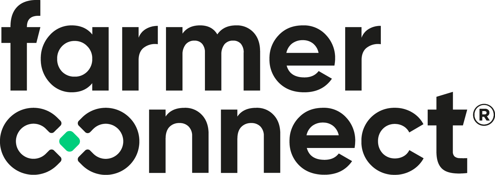



# FarmerConnect.Azure

<br />

This repository holds all the packages that have been standardized inside of FarmerConnect SA on how to use different Azure resources and patterns.

## FarmerConnect.Azure.Storage

```powershell
dotnet add package FarmerConnect.Azure.Storage
```

### Blob storage

Inside of the `Startup.cs` add the following line of code to add the blob storage service:

```csharp

```

Brief description of the packages

Content

Dependencies

How to add

How to use

### Table Storage

## FarmerConnect.Azure.Messaging

```powershell
dotnet add package FarmerConnect.Azure.Messaging
```

This package has all you need to start of implementing a messaging pattern with Azure Service Bus. When adding the package and configuring the messaging using the extension method a background worker will register the consumer service.

### Configuration

### Events

### Event handlers
Event handlers need to be registered with the DI System of ASP.NET Core.

```csharp
```

Brief description of the packages

Content

Dependencies

How to add

How to use

# Source Link

# License

Check the [LICENSE](LICENSE) file
